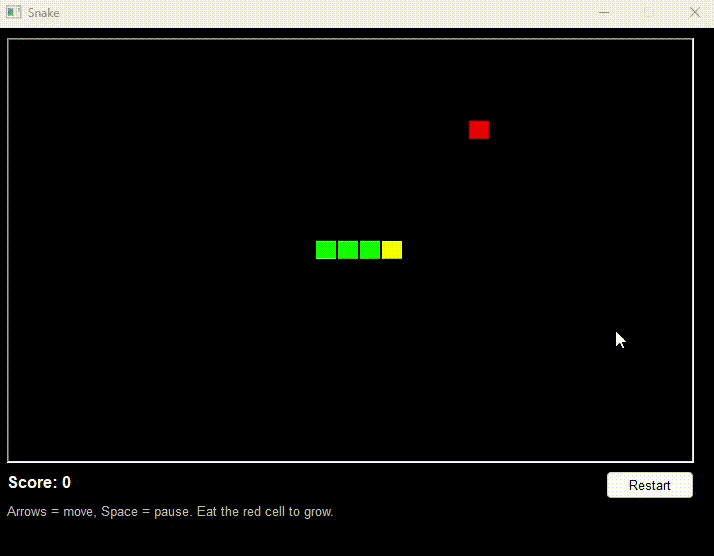

# 🐍 Pb_Snake_Dw

> A fully playable **Snake** game where the entire playfield lives inside a **single PowerBuilder DataWindow**. No external graphics, no images, no third‑party controls — just `Modify()` and a clever expression‑bound rendering trick.

-blue)




---

## ✨ Why?

I built a Minesweeper clone a while back where the whole minefield was a DataWindow with rectangles created on the fly. I wanted to push that idea further: could a DataWindow handle real‑time animation at several frames per second, smoothly, without flicker?

Turns out — yes, it can. This repo is the result.

## 🎮 How to play

| Key | Action |
|---|---|
| ⬆️ ⬇️ ⬅️ ➡️ | Move the snake |
| `Space` | Pause / resume |
| `Restart` button | New game |

- Eat the **red** square to grow.
- Walls **wrap around** — exit one side, appear on the opposite.
- Don't bite yourself.

## 🧠 How it works

The game state lives in two `long` arrays for the snake body coordinates plus an `integer` for the current direction. The grid is **31 × 21** cells.

The DataWindow `dw_snake` has:
- **One row per game row** (21 rows)
- **One `char(40)` column** called `cells` whose value encodes the state of every cell in that row using a single character per cell:

| Char | Meaning | Color |
|---|---|---|
| `0` | empty | invisible |
| `1` | snake body | 🟢 green |
| `2` | snake head | 🟡 yellow |
| `9` | food | 🔴 red |

At window open, `wf_init_grid()` issues 31 `Modify("create rectangle …")` calls — **once and only once** — to create one persistent rectangle per column. Each rectangle has its `visible` and `brush.color` properties bound to a **DataWindow expression** that reads from the `cells` column:

```
visible    = "0~tIf(long(mid(cells,N,1))>0,1,0)"
brush.color = "65280~tCASE(long(mid(cells,N,1)) WHEN 2 THEN 65535 WHEN 9 THEN 255 ELSE 65280)"
```

From that point on, **the timer never calls `Modify()` again**. To draw a new frame it only does 2 or 3 `SetItem` calls per tick (new head, old head → body, old tail → empty). The DataWindow re‑evaluates the expressions and repaints the affected cells. No flicker, no allocation, no garbage.

A small `ib_intimer` reentrancy guard prevents the timer event from running into itself if a tick takes longer than expected.

## 📁 Project layout

```
Pb_Snake_Dw/
├── pb_snake_dw.pbl/
│   ├── w_snake.srw      ← the window, game logic, timer, key handling
│   └── dw_snake.srd     ← the DataWindow definition
├── pb_snake_dw.pbproj
├── Pb_Snake_DW.pbsln
├── LICENSE
└── README.md
```

Two source files. Around **280 lines** of code total.

## 🚀 Build & run

1. Open `Pb_Snake_DW.pbsln` in **PowerBuilder 2025 (release 25)**.
2. Build the workspace.
3. Run `w_snake`.

That's it — no database connection, no external assets.

## 🙏 Credits

The original spark for this project was the [*Minefield DataWindow Game*](https://community.appeon.com/codeexchange/powerbuilder/400-minefield-datawindow-game) on Appeon CodeExchange — a Minesweeper clone where the entire minefield is dynamically built inside a DataWindow with `Modify()`. That was the proof that a DataWindow could be used as a full game canvas, and it directly inspired me to try something animated.

The cell‑binding rendering trick (creating rectangles once and driving them with DataWindow expressions instead of recreating them on every frame) was inspired by **René Ullrich**'s [*Three Simple Games*](https://community.appeon.com/codeexchange/powerbuilder/114-three-simple-games) on Appeon CodeExchange. His Snake taught me the pattern that turned my flickery prototype into something that actually feels smooth. Big thanks!

This project was developed by **Claude Code** following my ideas and direction.

## 📜 License

[MIT](LICENSE) © 2026 Ramón San Félix Ramón
